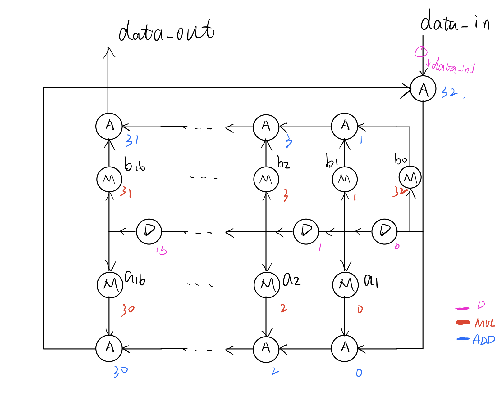

# Labs in VLSI Design

## Category

- `lab1`
  - update: April 10, 2022 update `new_code_for_lab1`
  - overview and **number** in `./new_code_for_lab1/filter_origin.v` is
  - 

## License

Unlike other repositories on GitHub, I do NOT provide a license for this repository. Thereby, users can not "copy, distribute, or modify your work without being at risk of take-downs, shake-downs, or litigation". This page describes what a user should do on no license project. After all, you're free to view these note yourself. PLEASE DON'T:

Make printed version of these notes at printing shop in SJTU.
Share these notes files in QQ groups or other places.
About
Lecture notes at SJTU
